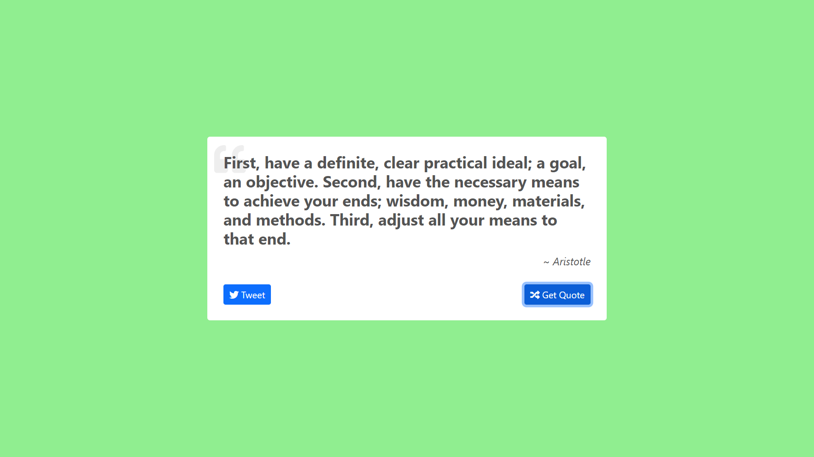
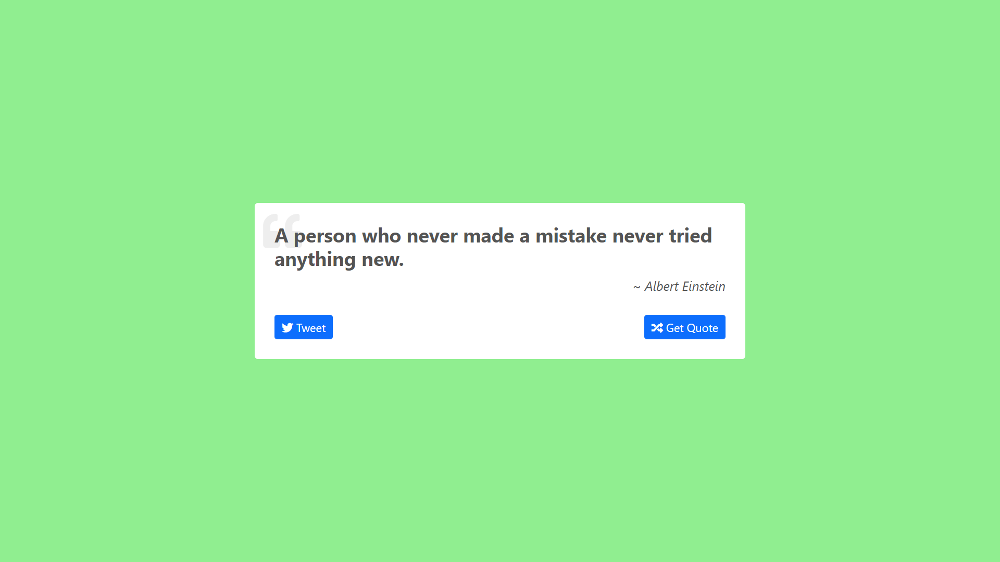

<!-- Please update value in the {}  -->

<h1 align="center">Random Quote Machine</h1>

   Solution for a challenge from  <a href="https://www.freecodecamp.org/" target="_blank">freeCodeCamp</a>.

  <h3>
    <a href="https://quote-world.netlify.app/">
      Demo
    </a>
     | 
    <a href="https://codepen.io/ajayboro7277/full/XWgxXgN">
      Solution
    </a>
     | 
    <a href="https://www.freecodecamp.org/learn/front-end-development-libraries/front-end-development-libraries-projects/build-a-random-quote-machine">
      Challenge
    </a>
  </h3>

<!-- TABLE OF CONTENTS -->

## Table of Contents

- [Overview](#overview)
  - [Built With](#built-with)
- [Features](#features)
- [Contact](#contact)
- [Acknowledgements](#acknowledgements)

<!-- OVERVIEW -->

## Overview

### Built With

<!-- This section should list any major frameworks that you built your project using. Here are a few examples.-->

- [ReactJS](https://reactjs.org/)
- [Bootstrap](https://getbootstrap.com/)
- [Quote API](https://gist.githubusercontent.com/camperbot/5a022b72e96c4c9585c32bf6a75f62d9/raw/e3c6895ce42069f0ee7e991229064f167fe8ccdc/quotes.json")
- [Font Awesome](https://fontawesome.com/)

## Acknowledgements

This application/site was created as a submission to a [freeCodeCamp](https://www.freecodecamp.org/learn/front-end-development-libraries/) challenge. The [challenge](https://www.freecodecamp.org/learn/front-end-development-libraries/front-end-development-libraries-projects/build-a-random-quote-machine) was to build a Random Quote Machine web application to complete the given user stories.

## Contact

- GitHub [@ajaybor0](https://github.com/ajaybor0)
- Twitter [@ajaybor0](https://twitter.com/ajaybor0)
- LinkedIn [@ajaybor0](https://www.linkedin.com/in/ajaybor0/)
